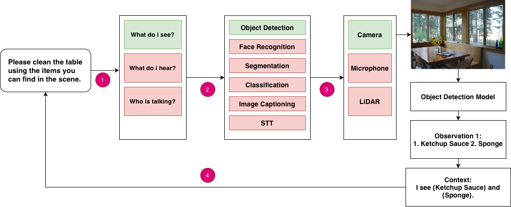

# Chain of Questions (CoQ): Guiding Multimodal Curiosity in Language Models

> **Accepted Paper – Link coming soon**  
> Paper: *[Google Drive](https://drive.google.com/file/d/12Rs7L0o1qABLsLLmHQhMqXDtpEJUnh89/view?usp=sharing)* | [Older Version - arxiv](https://arxiv.org/abs/2508.04350)  
> Code: *[Baseline Experiments](https://colab.research.google.com/drive/1VYKNKJmR-UKZZDTDTOQ2GekCbEw5CS0X?usp=sharing)* | [Result Loading](https://colab.research.google.com/drive/1j0U5Wk2qpWDrOQT2A3l4D6QQ2Hufl9Jj?usp=sharing)
> AgenticAI2025: *[Homepage](https://ric.psu.edu.sa/)* 


<!-- Replace with actual figure -->



## Overview

**Chain of Questions (CoQ)** is a curiosity-driven prompting framework designed to improve **multimodal reasoning** in large language models (LLMs).  
Instead of passively consuming multimodal inputs, CoQ enables models to **proactively generate targeted questions** that determine which sensory modalities (vision, audio, spatial, etc.) are required to answer a prompt accurately.  

This active questioning process aligns model reasoning with **human-like curiosity and perception**, improving interpretability, modality alignment, and reasoning performance across multimodal tasks.


## Paper Status

✅ **Accepted for publication at AgenticAI2025 (Springer)**  
📌 Final publication link will be added here once available.


## Abstract (Short)

Recent advances such as chain-of-thought prompting improve reasoning in text-only settings, but they do not fully extend to **multimodal environments**.  
CoQ introduces a **curiosity-driven questioning mechanism** that allows language models to dynamically activate relevant modalities, gather evidence, and reason more effectively.  
Experiments across integrated multimodal datasets demonstrate **improved modality alignment, interpretability, and reasoning accuracy** compared to passive multimodal approaches.


## Method Summary

The CoQ framework follows a structured reasoning pipeline:

Prompt → Question → Task → Sensor → Observation → Final Answer
1. **Prompt** – User input question  
2. **Question** – Model generates curiosity-driven multimodal queries  
3. **Task** – Each query maps to a perceptual task (e.g., object detection, speech-to-text)  
4. **Sensor** – Hardware/software modality activated  
5. **Observation** – Evidence collected and aggregated  
6. **Final Answer** – Reasoned response using multimodal context  

This process enables **active sensory exploration** rather than passive multimodal fusion.


## Key Contributions

- Introduces **curiosity-driven multimodal reasoning** for LLMs  
- Defines a **question → task → sensor** mapping framework  
- Builds a **large integrated multimodal benchmark dataset**  
- Demonstrates **performance gains over static multimodal models** in complex reasoning tasks  
- Provides a foundation for **agentic multimodal AI systems**


## Results (High-Level)

- Larger models show **higher modality-alignment accuracy** and curiosity rates.  
- The **CoQ agentic loop** significantly outperforms static multimodal baselines on complex tasks such as TextVQA.  
- Iterative questioning enables **better evidence gathering and reasoning precision**.


## Citation

```bibtex
@article{iji2025coq,
  title   = {Chain of Questions: Guiding Multimodal Curiosity in Language Models},
  author  = {Iji, Nima and Chapman, Peter and Dashtipour, Kia},
  year    = {2025},
  note    = {Accepted publication – link to appear}
}
```

## Authors

* Nima Iji – Edinburgh Napier University
* Peter Chapman – Edinburgh Napier University
* Kia Dashtipour – Edinburgh Napier University
